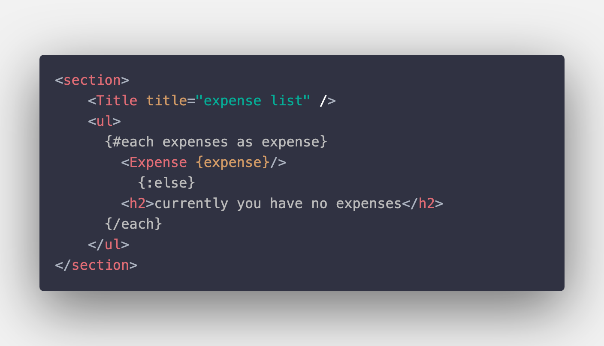
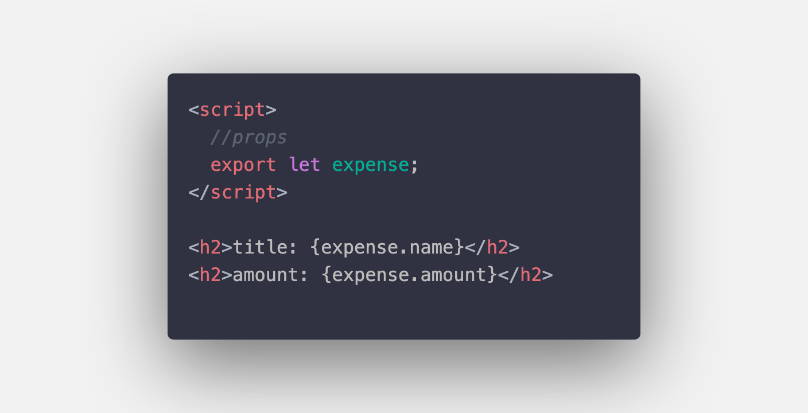
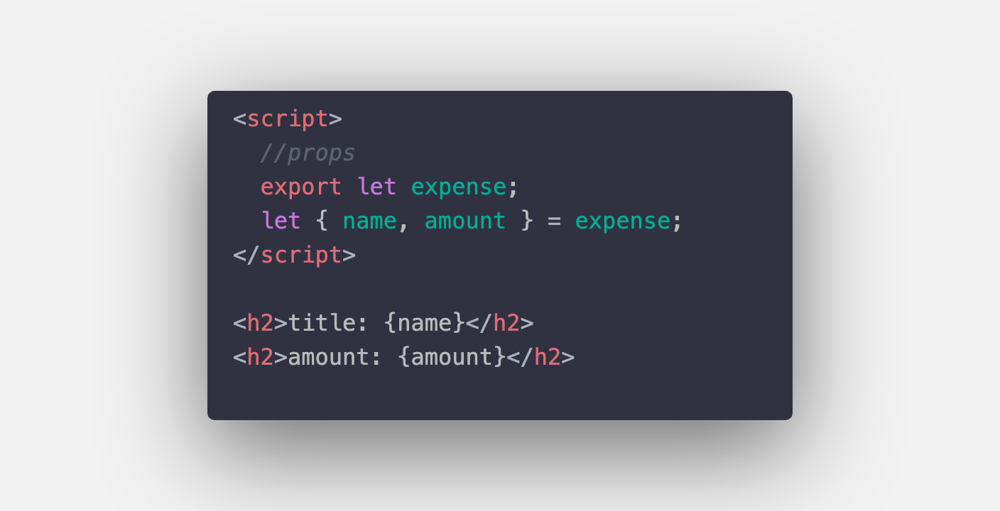
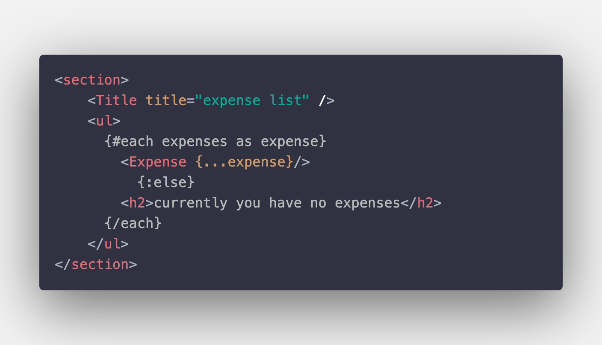
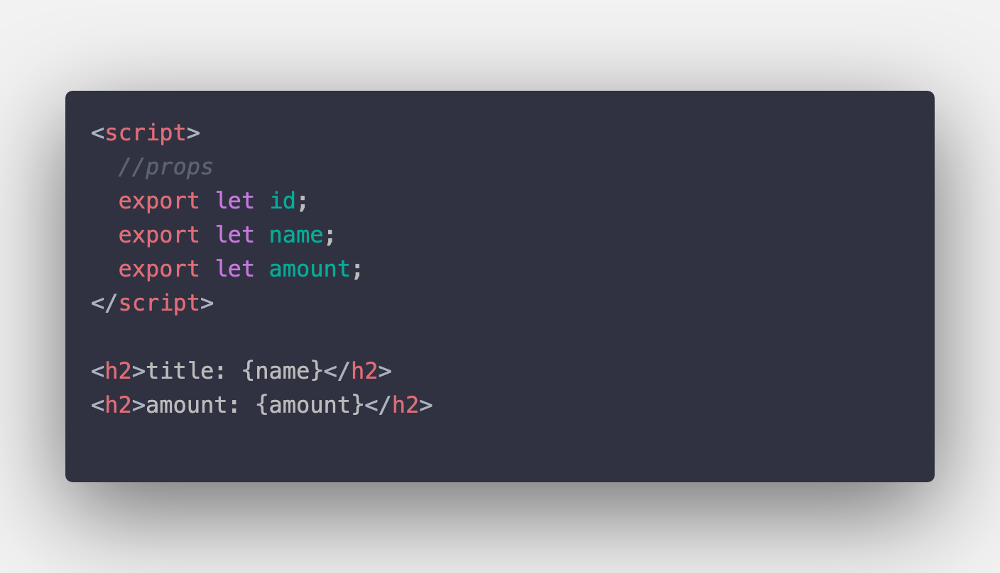
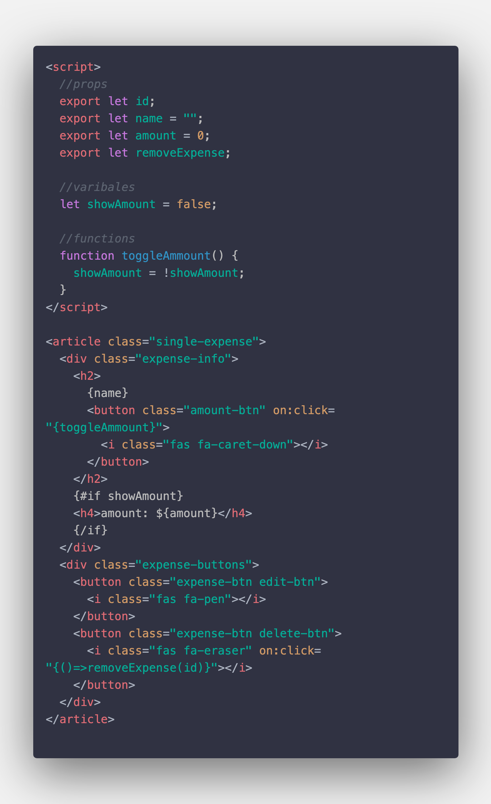
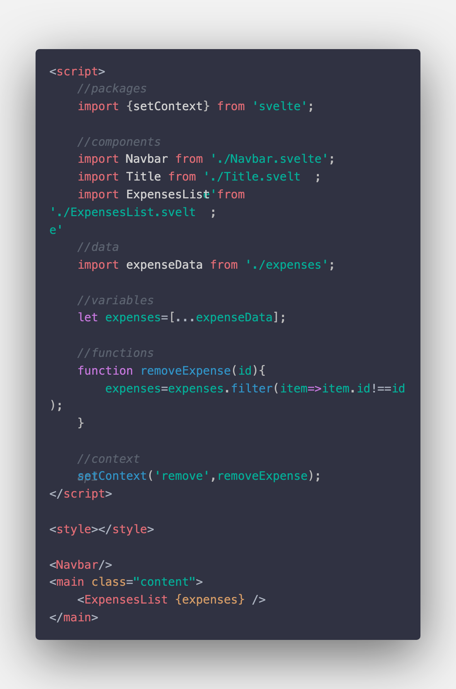
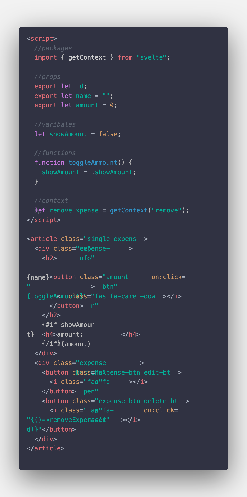

# Budget Calculator

## Project Creation

- Create a Project :beers:.
- ```bash
  npx degit sveltejs/template budget-calculator
  ```
- ```bash
  npm i
  ```
- ```bash
  git init
  ```
- Create a repository in github.
- Copy this below command and paste in VS code terminal
  ```bash
  git remote add origin https://github.com/SanthoshRaghav/budget-calculator.git
  ```
- ```bash
  npm add .
  ```
- ```bash
  npm commit -m "initial commit"
  ```
- ```bash
  git push -u origin master
  ```

## New Things to Remember

1. How to make "component spefic Css properties" to "global Css properties"

   ```css
   :global(span) {
     background: teal;
     color: white;
   }
   *parenthesescancontain: -(element, classsname, id);
   ```

2. Importing a JS file, suppose if you are importing a " js file ", then it does't requre a file extension.
   ```js
   import expensesData from "expenses";
   ```
3. import statements from ES6

   1. importing a component with in the current folder.

   ```js
   import component from "./component.svelte";
   ```

   2. importing a component outside the current folder.

   ```js
   import component from "../component.svelte";
   ```

   3. importing a "packages" from node modules folder.

   ```js
   import package from "packageName";
   ```

   4. Don't import props using const keyword :beetle: use "let" keyword

   ```js
   export const title = "Default title";
   ```

4. Ways to send props

   

   1. Sending props normally....

      

      #### we can receive props two ways...

      1. Normal way...

         

      1. Destructing way...

         

   2. Spreading props and sending....

      

      1. Receiving way...

         

5. Sending function as a prop (Parent to child)

   1. Parent Component

      

   2. Child Component (ExpenseList.svelte component)

      

   3. Child Component (Expense.svelte component)

      

6. Context API

   1. setContext

      

   1. getContext

      
